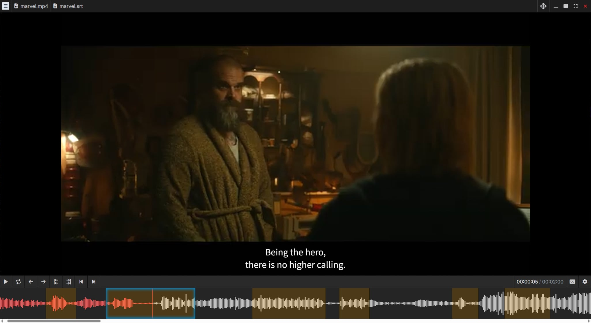

# Y'ALL Media Player

<div align="center">
  
  <br>
  <b>Y</b>et <b>A</b>nother <b>L</b>anguage <b>L</b>earning <b>M</b>edia <b>P</b>layer
  <br><br>
</div>

**Y'ALL MP** is not just a media player; it is a comprehensive tool designed to bridge the gap between passive listening and active learning.
It combines high-performance media playback with advanced tools to edit subtitle text and adjust timing, instant dictionary lookups, and seamless **Anki** flashcard creation.



Whether you are sentence mining, training listening comprehension, or practicing shadowing, **Y'ALL MP** provides the granular control and automation you need.

---

## ⚠️ Platform Status: Experimental Beta

**Y'ALL MP is primarily developed and optimized for Windows.**

Because this application relies on complex window management (transparent UI overlays stacked on top of a hardware-accelerated mpv window etc.), performance varies significantly across operating systems and window managers.

| Platform    | Status                   | Notes                                                                                                                                                                   |
|:------------|:-------------------------|:------------------------------------------------------------------------------------------------------------------------------------------------------------------------|
| **Windows** | ✅&nbsp;**Stable**        | Fully supported. Recommended experience.                                                                                                                                |
| **Linux**   | 🧪&nbsp;**Experimental** | **Known Issues:** Window stacking (Z-order) bugs on certain Window Managers (e.g., Lubuntu/LXQt, some Wayland compositors). The video may obscure the UI or vice-versa. |
| **macOS**   | 🧪&nbsp;**Experimental** | **Untested:** Requires manual terminal commands to run (see installation instructions). Stacking issues may occur.                                                      |

### 🤝 Call for Contributors

**Y'ALL MP** is developed and tested primarily on Windows.
As I do not have access to **macOS** hardware, specific layout quirks or pathing issues may occur on Mac.
**Linux** support is also experimental; testing has been limited to Lubuntu, where some window management issues were observed.
**Contributions to improve cross-platform support are greatly appreciated!**

---

## ✨ Key Features

### ✂️ Fully Interactive Timeline
*   **Visual Editing:** Your subtitles are not perfect? Not a problem! Adjust subtitle timings instantly by dragging clip edges on the timeline.
*   **On-the-Fly Corrections:** Fix typos or rewrite subtitle text entirely, directly within the player, without leaving the flow.
*   **Clip Management:** Split long sentences, merge broken lines or even add own subtitles.

### 📺 Professional Playback
*   **Powered by [mpv](https://mpv.io/):** Plays virtually any media format (MKV, MP4, WEBM, etc.) with hardware acceleration.
*   **Audio Waveform:** Visualize dialogue rhythm and silence with a high-precision timeline generated by [audiowaveform](https://github.com/bbc/audiowaveform).
*   **Context-aware Speed Control:** Automatically speed up silence or slow down difficult dialogue segments independently.
*   **Study Presets:** Switch instantly between **Listening Mode** and **Speaking Mode** to target specific skills, depending of your study goals.

### 💬 Advanced Subtitles
*   **Interactive Rendering:** Full support for complex interactive **ASS/SSA** subtitles with proper font attachment loading.
*   **Smart Tokenization:** Click on any word in subtitles or hold and drag to select entire phrases for dictionary lookup.
*   **Integrated Lookup:** Instant pop-up dictionary searches via built-in browser integration, with ability to configure own lookup services.
*   **Multi-Track Support:** Seamless switching between multiple parallel subtitle and audio tracks.

### 🧠 Sentence Mining & [Anki](https://apps.ankiweb.net/)
*   **One-Click Export:** Instantly create Anki cards containing the subtitle text, audio clip, and a video snapshot.
*   **Multiple Templates Support:** Configure multiple templates to map media data (text, audio, image, video) to your specific Anki note types, then export them all at once.
*   **Duplicate Prevention:** Automatically tracks export history to show which subtitled clips have already been exported.

### ⌛ Coming soon
*   **Offline Dictionaries Integration:** Fast, local dictionary lookups without the need of an internet connection.

---

<a id="system-requirements"></a>
## ⚙️ System Requirements

Depending on your operating system, you may need to install external dependencies for the **Y'ALL MP** to work.

### 🗔 Windows
**No additional actions required.** The installer comes pre-packaged with all necessary binaries (`mpv`, `audiowaveform`, `ffmpeg` etc.), enjoy!

### 🐧 Linux

1. **Install mpv:**
    See official instructions: [https://mpv.io/installation/](https://mpv.io/installation/)

> **⚠️ Important:** Default package managers (like `apt` on Ubuntu) often ship outdated versions of mpv (e.g., 0.32.x or 0.37.x) that lack required JSON IPC features or may crash the application.
>
> Please ensure you install a recent version (0.40+ recommended).

If the default installed version crashes or is too old, use this PPA to get the latest stable version (0.40+):

```bash
sudo add-apt-repository ppa:ubuntuhandbook1/mpv
sudo apt update
sudo apt install mpv
```

Validate that everything was installed correctly by running `mpv --version`, make sure the version is 0.40 or higher.

2. **Install audiowaveform:**
    [https://github.com/bbc/audiowaveform/releases](https://github.com/bbc/audiowaveform/releases)

```bash
sudo add-apt-repository ppa:chris-needham/ppa
sudo apt-get update
sudo apt-get install audiowaveform
```

3. **Ensure you have `libfuse2` installed on your system.**

```bash
sudo apt-get update
sudo apt-get install -y libfontconfig1-dev libarchive-tools
```

4. **Manage the app permissions**

Run the following command on the downloaded AppImage file:

```bash
sudo chmod +x ./<filename>.AppImage
```

5. **Finally run the app in console**

```bash
./<filename>.AppImage --no-sandbox
```

### 🍎 macOS

1. **Install mpv:**
   See official instructions: [https://mpv.io/installation/](https://mpv.io/installation/)

```bash
brew install mpv
```

2. **Install audiowaveform:**
   [https://github.com/bbc/audiowaveform/releases](https://github.com/bbc/audiowaveform/releases)

```bash
brew tap bbc/audiowaveform
brew install audiowaveform
```

---

## 📥 Installation & Usage

### Download
Visit the [main page](https://yallmp.com) or [release list](https://github.com/kgurniak91/yall-mp/releases) to get the **Y'ALL MP** installer for your platform (`.exe`, `.AppImage`, or `.dmg`).

### macOS Users (Important)
This application is not code-signed (which requires a paid Apple Developer account). To run it, you must remove the quarantine attribute after dragging the app to your Applications folder:

1.  Drag `<filename>.dmg` to your **Applications** folder.
2.  Open **Terminal**.
3.  Run:
    ```bash
    xattr -cr "/Applications/<filename>.dmg"
    ```
4.  Launch the app.

---

## 💻 Development

### Prerequisites
*   **Node.js** (v22+ recommended)
*   **npm**
*   **System Dependencies:** Ensure you have installed the requirements listed in the [System Requirements](#system-requirements) section above.

### Setup

1.  **Clone the repository:**
    ```bash
    git clone https://github.com/kgurniak91/yall-mp.git
    cd yall-mp
    ```

2.  **Install dependencies:**
    This will also download Windows-specific binaries via the `postinstall` script.
    ```bash
    npm install
    ```

### Running the App

To run in development mode with hot-reloading (Angular + Electron):

1.  **Start the build watcher:**
    ```bash
    npm run electron:watch:build
    ```
    *Wait until the initial build completes.*

2.  **Launch the Electron shell (in a new terminal):**

    On Windows:

    ```bash
    npm run electron:watch:run
    ```

    On Linux:

    ```bash
    npm run electron:watch:run -- --no-sandbox
    ```

### Testing

*   **Angular Tests (Karma):** `npm run test:angular`
*   **Electron Tests (Vitest):** `npm run test:electron`
*   **Run All:** `npm run test:all`

## 📦 Building the Application

To create a distributable installer/executable for your current OS:

*   **Windows:** `npm run package:win`
*   **Linux:** `npm run package:linux`
*   **macOS:** `npm run package:mac`

The output files will be located in the `dist_electron` folder.

---

## 🛠️ Tech Stack

**Core Application**
*   **[Electron 37](https://www.electronjs.org/):** Cross-platform desktop framework.
*   **[Angular 19](https://angular.io/):** Frontend framework with **Signals** for reactive state management.
*   **[PrimeNG 19](https://primeng.org/):** UI Component library.

**Media & Processing**
*   **[Node-MPV](https://github.com/j-holub/Node-MPV):** Node.js wrapper for controlling the MPV player instance via IPC.
*   **[Audiowaveform](https://github.com/bbc/audiowaveform):** C++ program used to generate waveform JSON data from audio streams.
*   **[FFmpeg Static](https://www.npmjs.com/package/ffmpeg-static):** Bundled FFmpeg binary for extracting audio/video clips for Anki export.

**Subtitles & Text**
*   **[ASS-Compiler](https://github.com/weizhenye/ass-compiler):** Parses and compiles ASS subtitle formats.
*   **[ASS.js](https://github.com/weizhenye/ASS):** Renders interactive ASS subtitles on HTML5 canvas.
*   **[Wavesurfer.js](https://wavesurfer-js.org/):** Renders the audio waveform timeline.
*   **[BudouX](https://github.com/google/budoux):** Machine Learning model for proper line breaking and word segmentation (Chinese/Japanese/Thai).
*   **[Franc](https://github.com/wooorm/franc):** Language detection for selecting the correct tokenizer.
*   **[Font-Scanner](https://github.com/axosoft/font-scanner):** Locates system fonts to properly render styled subtitles.

---

## 📄 License

This project is licensed under the **GNU General Public License v3.0 (GPLv3)**.

You are free to use, modify, and distribute this software. If you distribute modified copies, they must also be released under the GPLv3. See the [LICENSE](LICENSE) file for details.
